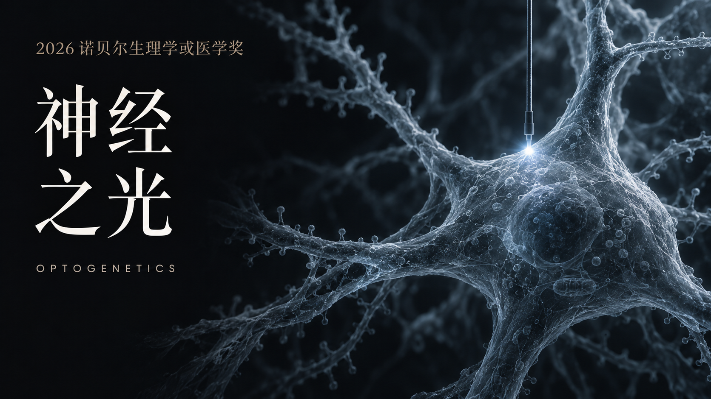

# 神经之光 · Neural Light

一部以光遗传学为主题的科学短片，使用 WebGL2 粒子动画、HTML/SVG 字幕和 Python 程序合成配乐制作。项目保留原片的 2026 诺贝尔生理学或医学奖主题与文字。



当前工程对应 **3840 × 2160、30 fps、102.5 秒**的音频修正版。动画和音乐共用 `film/timeline.js` 中的时间点。章节文本见 [chapters.txt](chapters.txt)。

## 安装

需要 Node.js 20 或以上、Python 3.11–3.13、FFmpeg（含 libx264）、支持 WebGL2 的 Chromium。macOS 默认使用 Metal 和 H.264 硬件编码，Linux 默认使用 SwiftShader 和 libx264。

```bash
npm ci
npx playwright install chromium
python3 -m venv .venv
source .venv/bin/activate
python -m pip install -r requirements.txt
```

macOS 可用 `brew install ffmpeg` 安装 FFmpeg。Linux 运行浏览器缺系统依赖时，可使用 `npx playwright install --with-deps chromium`。

## 一次生成完整成片

```bash
bash render_all.sh
```

结果保存在 `renders/neural-light-4k.mp4`。视频、音轨和渲染中间文件均不纳入版本控制。

只生成前一秒，用来检查环境：

```bash
bash render_all.sh --to=30
```

## 分别生成画面与配乐

```bash
npm run render
python audio/score.py renders/score-clean.wav
npm run stills
```

画面输出 `renders/picture-4k.mp4`，抽帧输出 `renders/stills/`。为快速预览某个场景：

```bash
npm run render -- --stills=20,58,99
```

在浏览器查看静态场景：

```bash
npm run preview
```

打开 `http://127.0.0.1:8080/film/` 后，在浏览器控制台调用 `renderFrame(58)` 可定位到 58 秒。页面默认不自动播放，导出器直接按指定时间逐帧渲染。

## 渲染选项

```bash
node film/render.mjs --from=0 --to=3075 --out=renders/picture-4k.mp4
node film/render.mjs --encoder=libx264 --crf=20 --preset=fast
node film/render.mjs --encoder=h264_videotoolbox --bitrate=60M
```

`--from` 和 `--to` 使用帧编号，后者不包含在输出中。macOS 默认码率为 60 Mbps；libx264 使用 CRF 20 并限制最高码率，以控制粒子与胶片颗粒带来的文件体积。

`CHROMIUM_PATH` 可指定已有 Chromium 可执行文件，`FFMPEG_PATH` 可指定 FFmpeg，`PYTHON` 可指定合成配乐时的 Python。代理环境下，请让 `NO_PROXY` 和 `no_proxy` 包含 `127.0.0.1,localhost,::1`；完整渲染脚本已包含这项设置。

## 工程结构

| 路径 | 内容 |
| --- | --- |
| `film/engine.js` | 4K WebGL2 粒子、景深、辉光与后期 |
| `film/s_*.js` | 光子、绿藻、离子通道、神经元、大脑及片尾场景 |
| `film/ui.js` | 字幕、标注线与文字动画 |
| `film/timeline.js` | 动画与音轨共同使用的时间点 |
| `film/render.mjs` | Chromium 逐帧渲染及编码 |
| `audio/score.py` | 48 kHz 立体声合成配乐、音效与混音 |
| `assets/cover.png` | 最新封面：神经之光 |

## 音频修正

持续高频空气噪声已关闭；水下噪声铺底、电击与扫频音效降低；持续音色加入正弦成分以减弱蜂鸣感；压缩器增益使用连续插值，短音首尾做平滑处理。音乐的和声、节奏和场景触发时间保持原有结构。

此前完整成片已经验证 3075 帧、102.5 秒的音画时长、无解码错误与无削波。该仓库的可移植导出流程另做了关键场景抽帧和短片合成检查；不同平台的浏览器、字体栅格化和编码器可能产生细微差异。

## 字体

随工程提供 Noto Serif CJK、Noto Sans SC、Inter 和 TeX Gyre Pagella，避免缺字体造成字幕变化。字体的原始授权文本见 `film/fonts/LICENSE-*.txt`，来源与名称见 [film/fonts/README.md](film/fonts/README.md)。
